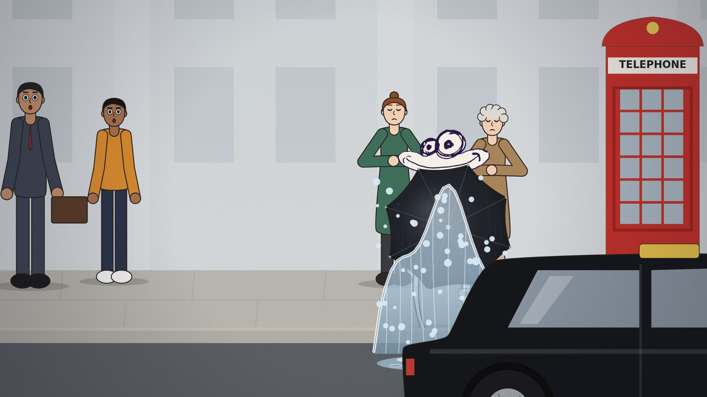

# The Umbrella Walk



A 76-second 2D cartoon: a man in a long black coat walks through the city with a closed umbrella and a coffee, and quietly fixes everyone's little disasters on the way. Every frame is drawn by code, and there are no image or video assets. You render the film yourself with one command.

- 1920×1080, 24 fps, 1,839 frames, 19 shots
- Plain JavaScript drawing on an HTML canvas, rendered by headless Chromium and encoded by ffmpeg
- Every cut sits on the beat of the music, and every sound is synthesised (see [Sound](#sound))

## Render it

You need **Python 3.9+**, **ffmpeg** and a few minutes.

```bash
pip install -r requirements.txt
python3 -m playwright install chromium
python3 tools/render_film.py
```

The film lands in `out/umbrella_walk.mp4`. It takes 2–3 minutes on an ordinary laptop (it renders several shots at once; `--workers N` sets how many).

Installing ffmpeg: `brew install ffmpeg` (macOS), `sudo apt install ffmpeg` (Ubuntu/Debian) or `winget install ffmpeg` (Windows).

### With a coding agent

Open the folder in Claude Code or Codex and ask:

> Read AGENTS.md, then render the film.

Both tools read [`AGENTS.md`](AGENTS.md) (Claude Code through `CLAUDE.md`). It tells the agent how to set up, preview, change and re-render the film.

### Without installing anything

Fork the repo on GitHub, open the **Actions** tab, choose **Render film** and click **Run workflow**. After a few minutes the MP4 appears under **Artifacts** on the finished run. The workflow also runs on every push to `main` that touches the film.

## Look before you render

`tools/preview.py` draws stills straight from the code in a few seconds, with no video encoding:

```bash
python3 tools/preview.py --shot 6 --every 0.25          # shot 6, every quarter second
python3 tools/preview.py --shot 9 --at 1.9 2.2 2.9      # shot 9 at those seconds
```

The contact sheet goes to `out/preview.jpg`. To re-render only what you changed, run `python3 tools/render_film.py --shots 6 9`. Each shot goes into its own file under `out/shots/`.

## The shots

| # | Shot | What happens |
|---|------|--------------|
| 1 | Top hat | A gust takes a gentleman's hat; he catches it on the umbrella tip, spins it and flicks it back onto his head. |
| 2 | Scooter | A kid on a scooter, eyes on his phone, heads for a lamppost; one tap on the handlebar and he curves round it at full speed. |
| 3 | Postman | A dog barks through the letterbox and the postman's letters fly; the tip juggles them into the slot, one, two, three. |
| 4 | Pigeon | A pigeon's dropping falls for his head; he taps it into a planter, and some of it stays on the tip. |
| 5 | Flowerpot | The dirty tip saves a falling pot (leaving a smear on it); the pigeon poops on a man reading on a bench, and gets it flicked straight back. |
| 6 | Butcher | He wipes the tip clean on his own trouser leg; a bulldog steals a chain of sausages; one chop, one snip, and the falling sausage ends up skewered on the tip. |
| 7 | Cat | The sausage on the tip coaxes a cat out of a tree and into a girl's hands. |
| 8 | Pond | Snapping the umbrella open is the gust that fills a becalmed toy boat's sails. |
| 9 | Wet concrete | He hooks the crook over a scaffold rail and glides over the fresh concrete, knees up, coffee level. |
| 10 | Ice cream | A dropped cone and two gold coins flicked into the tip jar. |
| 11 | Painter | He flicks a painter's lost glasses back onto his nose. |
| 12 | Van | He taps a sliding box back into the van and slides its door shut. |
| 13 | Handbag | A stolen bag catches on the level shaft and slides back to its owner. |
| 14 | Taxi | The open umbrella takes a taxi's puddle splash for two women, and the run-off rinses his trousers clean. |
| 15 | Raindrop | The first drop of rain lands in his coffee's sip hole. |
| 16 | Face | A drop on the cheek, a look up, a smile. |
| 17 | Stance | The rain comes on; his fencer's lunge pops a woman's stuck umbrella open. |
| 18 | Exit | He finally opens his own umbrella and walks off. |
| 19 | Last word | The pigeon picks the wrong target: the cat. |

## Sound

Every sound in the film is synthesised by a small physical model, and none of it is a recording, so it is all free to use: a cat's meow and purr from a larynx and a cat-sized throat, rain from tens of thousands of tiny impacts, the rail's clang from the modes of a steel tube, the taxi's Doppler from the real travel time of sound. The footsteps are measured from the drawings, so every foot that lands makes a sound. Each shot has its own acoustics.

```bash
python3 tools/probe_motion.py     # footfalls, measured from the picture -> audio/steps.json
python3 tools/guide_track.py      # a synthesised jazz guide score with the film's hit points -> audio/guide.wav
python3 tools/sfx_track.py        # effects and ambience -> audio/sfx.wav, and mixed with the guide -> audio/guide_sfx.wav
python3 tools/render_film.py --audio audio/guide_sfx.wav
```

The music the film was originally cut to is **not** in this repository (it came from the video this film remakes, and it isn't ours to share). The guide score keeps the same beat and hits; to use your own music, see [docs/MUSIC.md](docs/MUSIC.md). How the sound is designed, and every sound model, is in [docs/SOUND.md](docs/SOUND.md).

## Direct it in the studio

```bash
python3 tools/build_studio.py     # -> out/studio.html, one file that opens in any browser
```

The studio is the film taken apart into what it is made of: 19 acts, their named moments, about 70 actors (the man, the cat, the dog, the butcher, the top hat, trees, walls, the camera…) each with a skeleton you can drag, and all 360 sounds, each with its spectrum. Click anything, pose it on any frame, move a moment, paint on a sound's spectrum, draw on the picture, write what you want, attach pictures or recordings. **Brief** turns all of it into instructions for an agent. See [docs/STUDIO.md](docs/STUDIO.md).

## Change it

The film is built to be changed, by you or by a coding agent. Everything that happens has a name and a time in [`timeline.json`](timeline.json), and the drawing, the sound effects and the music hits all read it, so they stay in sync when you move things. To see it all as a cue sheet:

```bash
python3 tools/timeline.py --shot 9
```

```
 9  WET CONCRETE    34.62-39.12 s  (frames 831-938, 4.50 s, site)
    He hooks the crook over a scaffold rail and glides over the fresh concrete, knees up, coffee level.
    drawn in src/s2.js; footsteps: hero 9
    ...
    T_HOOK    1.86                   the crook hooks the rail: clang
                                       sfx   -> the crook hooks the rail
                                       guide -> the crook hooks the rail
    T_GO      1.98                   the glide starts
                                       sfx   -> the glide
    ...
```

Things you can ask an agent (Claude Code, Codex, or one in your browser that can clone the repo), after "Read AGENTS.md":

- *Make the bulldog a dalmatian, and give the butcher a red apron.*
- *In the pond shot, let the kids cheer a beat later, and make the umbrella snap louder.*
- *The cat should meow twice in shot 7, the second one higher.*
- *Replace the guide score with `my_score.wav` and fit the cuts to it.*
- *Add a shot where he holds a door for a delivery man.*

[`AGENTS.md`](AGENTS.md) maps every kind of change to the file to edit and the way to check it. The deeper guides are [docs/ANIMATION.md](docs/ANIMATION.md) (characters, objects, shots, movement), [docs/SOUND.md](docs/SOUND.md) and [docs/MUSIC.md](docs/MUSIC.md). An agent that can't listen can use `tools/ear.py`, a sound classifier that says what it hears.

## How it's built

```
timeline.json the film's timing: each shot's frames and its named moments (read by the picture and the sound)
src/          the film (plain JS, concatenated in this order by tools/build.py)
  core.js       math, easing, keyframes, camera, drawing helpers, the timeline, shot registry
  hero.js       the hero: side, front and back rigs, umbrella, coffee, arm IK
  cast.js       the other characters (people, dog, cat, pigeon)
  props.js      objects: top hat, sausages, sailboat, pots, van, taxi, ...
  lib.js        the cast's looks (CAST), shared sets: streets, bystanders, wind
  s1.js         shots 1-5
  s2.js         shots 6-10
  s3.js         shots 11-19
  main.js       renderFrame(ctx, t)
audio/        beats.json (the beat grid), steps.json (footfalls, from probe_motion.py)
docs/         ANIMATION.md, SOUND.md, MUSIC.md, STUDIO.md
studio/       the studio page: instrument.js (drawing calls -> actors), app.js, audio.js, store.js, index.html, style.css
tools/        build.py, preview.py, render_film.py, render_segment.py      the picture
              timeline.py (the cue sheet)
              probe_motion.py, guide_track.py, sfx_track.py                the sound
              sfxdsp.py, sfxanimals.py, sfxworld.py                        the sound models
              sound_lab.py (hear one sound), ear.py (a machine ear), fit_music.py (cuts to new music)
              build_studio.py (the studio page)
```

`dist/` (the built script) and `out/` (stills and videos) are generated and not committed.
